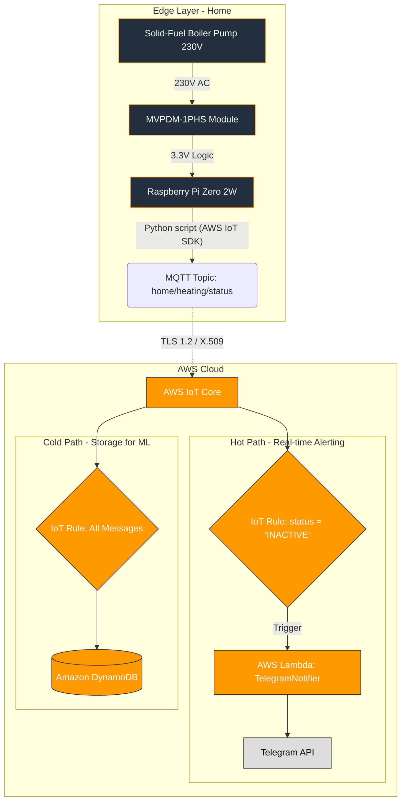

# 🌟 Project Overview: Boiler Status Monitor (AWS IoT Edge)

## 🎯 Key Engineering Goals

This project demonstrates a robust, cost-optimized, and event-driven Internet of Things (IoT) pipeline 
designed to monitor a dual home heating system. The core function is to detect the operational state of 
a solid-fuel boiler by monitoring the power status of its circulation pump.

## 📐 Architecture Design (System Design)

The project utilizes an event-driven IoT pipeline to monitor the boiler's status in real-time and provide alerts.

	
## 🛠️ Technologies Used

| Category          | Technology                | Purpose                                                                 |
|-------------------|---------------------------|-------------------------------------------------------------------------|
| Edge Compute      | Raspberry Pi Zero 2 W     | Edge device running the status monitoring Python script.                |
| Edge Sensing      | MVPDM-1PHS Module         | Safe galvanic isolation and detection of 230V AC pump status.           |
| Programming       | Python (3.11+)            | Edge logic, Lambda handler, and AWS CDK IaC definition.                 |
| Cloud Ingestion   | AWS IoT Core              | Secure MQTT Message Broker and Rule Engine.                             |
| Serverless Logic  | AWS Lambda                | Executing the stateless Telegram notification logic.                    |
| Alerting          | Telegram Bot API          | Free, reliable, cross-platform push notifications.                      |
| Data Storage      | Amazon DynamoDB           | Low-latency storage of historical status events for analytics.          |
| Deployment/DevOps | AWS CDK, GitHub Actions   | Automated deployment of cloud resources (Infrastructure as Code).       |
